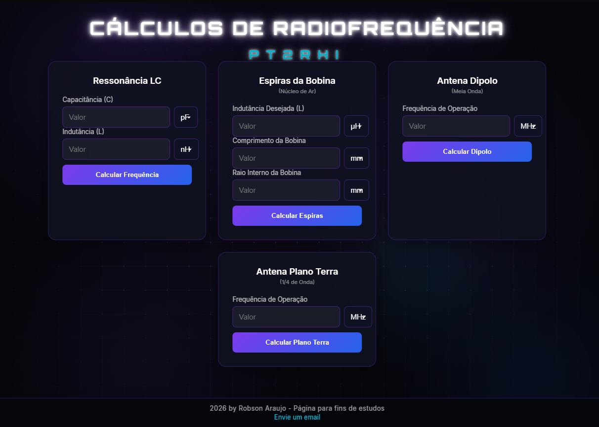

# 📻 Cálculos de Radiofrequência - PT2RHI

> Uma suíte de calculadoras web para Radioamadores, estudantes de eletrônica e entusiastas da radiofrequência. Desenvolvido com um design moderno e foco em cálculos precisos para construção de antenas e circuitos ressonantes.


---
 
## ✨ Funcionalidades

A página conta com **4 calculadoras interativas**, todas com conversão automática de unidades (pF, nF, µF, nH, µH, etc.) e validação de dados:

1. **Ressonância LC:** Calcula a frequência de ressonância de um circuito indutivo-capacitivo.
2. **Espiras da Bobina:** Calcula a quantidade exata de espiras necessárias para construir um solenoide de núcleo de ar.
3. **Antena Dipolo:** Calcula o comprimento total e das pernas de uma antena Dipolo de Meia Onda (considerando o fator de velocidade prático).
4. **Antena Plano Terra:** Calcula o tamanho do radiante e dos radiais (0° e 45°) para casar a impedância em 50 Ohms.

---

## 🔬 Fórmulas Utilizadas

Para garantir a precisão exigida pelo radioamadorismo, as seguintes fórmulas físicas e práticas foram aplicadas:

* **Frequência LC:** `f = 1 / (2 * π * √(L * C))`
* **Espiras (Núcleo de Ar):** `N = √( (L * l) / (μ₀ * A) )` *(onde μ₀ é a permeabilidade magnética do vácuo)*
* **Dipolo Prático (Meia Onda):** `Comprimento Total = 142.5 / f(MHz)`
* **Plano Terra Prático (1/4 Onda):** `Radiante = 71.5 / f(MHz)` *(Radiais a 45° calculados com acréscimo de 5% para casar em 50Ω)*

---

## 🎨 Design e Interface

* **Tema Escuro (Dark Mode):** Foco na leitura sem cansar a vista, ideal para a "Shack Room".
* **Animação de Fundo:** Grid animado usando a API nativa de `Canvas` do HTML5 com ondas de senos/cossenos.
* **Tipografia:** Fonte científica *Orbitron* para os títulos.
* **Glassmorphism:** Cards com efeito de vidro translúcido.
* **Responsivo:** O layout se adapta perfeitamente a telas de monitores (Grid) e celulares (Empilhado).

---

## 🚀 Como rodar o projeto

Como se trata de um projeto 100% estático (Front-End puro), você não precisa de nenhum servidor complexo.

1. **Clone o repositório:**
   ```bash
   git clone https://github.com/seu-usuario/calculadora-pt2rhi.git
